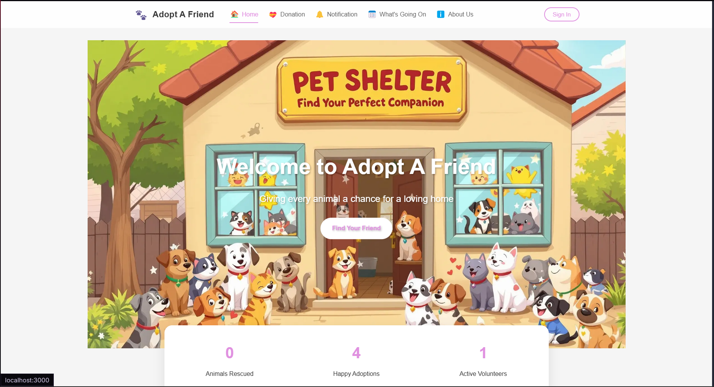

# 🐾 AdoptaFriend
============

**AdoptaFriend** is a web application developed to help shelter animals find loving new homes and to bring animal lovers and shelters together. This platform aims to facilitate the animal adoption process, support shelters, and raise awareness about animal rights.

Features
--------

Our project offers the following key features with a user-friendly interface:

*   **View Animals:** A main page listing all our friends waiting for adoption, with a filtering feature for users to search specifically for "Cats" or "Dogs".
    
*   **Adoption Process:** Detailed profile pages for each animal (including age, breed, health status) and a comprehensive "Animal Adoption Application Form" designed to promote responsible and conscious adoption.
    
*   **Volunteer Program:** A "Become a Volunteer" section and application form for animal lovers who want to support shelter activities with their time and skills.
    
*   **Donation Channel:** A "Donate" section where users can easily make donations to meet the needs of our shelters (food, veterinary expenses, care, etc.).
    
*   **Announcements and News:** A "News" section where current news, events, and announcements related to the shelters are shared.

*   **About Us:** An "About Us" page explaining the project's purpose, mission, and vision.
    

## Screenshots

### Home Page

### Adoptable Animals Page

### Donation Page

Tech Stack
----------

This project was developed using modern and performance-oriented web technologies:

*   [**React**](https://reactjs.org/): A popular JavaScript library for building user interfaces.
    
*   [**Next.js**](https://nextjs.org/): A production-ready React framework that enables features like server-side rendering (SSR) and static site generation (SSG) to enhance React applications.
    
## Developers

- [Doğukan Yurtturk](https://github.com/dgkann)  
- Deniz Beril Pekin

Setup and Launch
----------------

You can run the project on your local machine by following these steps:

1.  git clone https://github.com/dgkann/adoptafriend.git
    
2.  cd adoptafriend
    
3.  npm install
    
4.  npm run dev
    
5.  You can now view the application by opening http://localhost:3000 in your browser.

